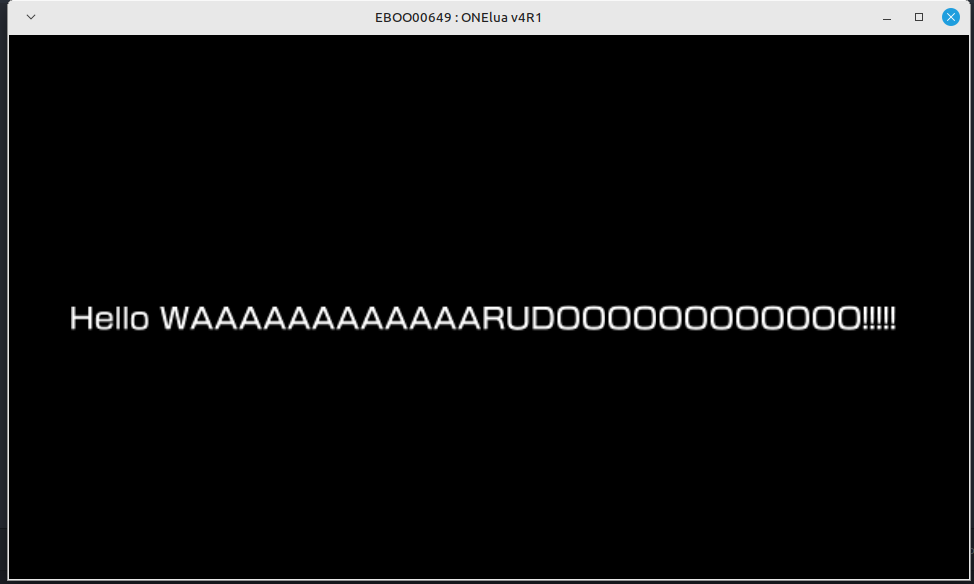

# LOVE-WrapLua

A LÖVE 11.5 compatibility layer for PSP, PS Vita, and PS3.  Drop your LÖVE game into `game/` and boot the wrapper — it re-implements the LÖVE API using each console's native Lua SDK.

---

## Supported platforms

| Platform | SDK |
|---|---|
| PS Vita | OneLua |
| PSP | OneLua (PSP sub-mode) |
| PS Vita (alternative) | lpp-vita |
| PS3 | Lua Player PS3 |

---

## Getting started

1. Copy your LÖVE project files into the `game/` directory (`main.lua`, `conf.lua`, assets, etc.).
2. Optionally create `game/conf.lua` and call `love.conf(t)` to configure your game title and modules.
3. Optionally add a `lv1luaconf` table to configure the wrapper:

```lua
lv1luaconf = {
    keyconf  = "XB",    -- "XB" (Xbox layout), "XBA" (swapped confirm), or "PS" (PlayStation layout)
    imgscale = false,   -- scale images to 75% (useful for PSP's smaller screen)
    resscale = false,   -- scale all coordinates to 75%
}
```

4. Deploy to your console using the usual method for your SDK.

### Entry points

| File | Purpose |
|---|---|
| `script.lua` | Main bootstrap — loads all modules, runs the game loop |
| `index.lua` | lpp-vita entry point (loads `script.lua`) |
| `app.lua` | Lua Player PS3 entry point (loads `script.lua`) |

---

## LÖVE 11.5 API coverage

See `Implemented.md` for the full table.  Summary:

- **love.graphics** — images, quads, all 2D primitives, fonts, print/printf, SpriteBatch, Text/TextBatch, ParticleSystem, transform stack (push/pop/translate/rotate/scale), scissor, blend mode (stub), Canvas/Shader/Mesh (stubs)
- **love.audio** — newSource, play/stop/pause/resume, volume, looping, clone
- **love.keyboard** — isDown, isScancodeDown, showTextInput
- **love.joystick** — getJoysticks, axis/button/hat state, gamepad name mapping
- **love.timer** — getTime, getDelta, getFPS, sleep
- **love.filesystem** — read/write/append, getInfo, lines, newFile, newFileData, directory helpers
- **love.math** — random, noise (Perlin), newTransform (full 2D affine), newBezierCurve, triangulate, colorFromBytes/ToBytes
- **love.data** — encode/decode (base64, hex), ByteData, DataView, pack/unpack
- **love.window** — getDimensions, getTitle/setTitle, getMode (always fullscreen on consoles)
- **love.thread** — channels (push/pop/peek/clear), coroutine-based pseudo-threads
- **love.system** — getOS, getLanguage, getUsername
- **love.touch / love.mouse** — Vita front touchscreen (OneLua only)

---

## Running the tests

Tests run on a standard desktop Lua 5.3+ interpreter — no console required.

```bash
lua tests/run_all.lua
```

Individual suites can be run in isolation:

```bash
lua tests/test_math.lua
lua tests/test_graphics.lua
```

---

## Known limitations

- **Canvas** — stub only; `renderTo(fn)` calls `fn()` but no offscreen rendering occurs.
- **Shader / Mesh** — stubs; objects exist so call-sites don't crash, but nothing renders.
- **Polygon fill** — fan triangulation from centroid; wrong for concave polygons.
- **PS3 graphics primitives** — mostly stubs (rectangle, circle, etc.) pending SDK confirmation.
- **love.data.hash** — returns zeroed bytes of the correct length; no real crypto.
- **love.data.compress/decompress** — pass-through; no actual compression.
- **love.audio (OneLua)** — limited to 2 simultaneous channels (1 static + 1 stream).
- **love.audio (PS3)** — stream sources only.
- **Transforms (PSP / lpp-vita / PS3)** — no-ops or approximations; full transform stack is Vita/OneLua only.
- **Color range** — LÖVE 11.x uses 0–1 floats.  Game code written for older 0–255 APIs must be updated.

---

## Project structure

```
game/           ← your LÖVE game lives here
script.lua      ← wrapper bootstrap
LOVE-WrapLua/
  math.lua / filesystem.lua / data.lua    ← shared modules (pure Lua)
  window.lua / joystick.lua / system.lua
  love-functions/thread.lua
  OneLua/       ← Vita + PSP platform modules
  lpp-vita/     ← lpp-vita platform modules
  PS3/          ← PS3 Lua Player platform modules
tests/          ← unit tests (desktop Lua 5.3+)
Implemented.md  ← detailed API coverage table
AGENTS.md       ← AI agent orientation guide
```

---

## Notes

- Tested primarily on PSP and Vita.  PS3 support is less complete.
- Most testing is done via RetroArch (PSP/Vita cores).
- Assets in the sample project are from [Kenney](https://kenney.nl/assets/scribble-dungeons) and [game-endeavor](https://game-endeavor.itch.io/mystic-woods) — go show them some love!
- This is a hobby project; it gets updated when time allows.

---

## Credits and thanks

- [OneLua](http://onelua.x10.mx/) team — for their outstanding contributions to the PSP/Vita homebrew community.
- [LukeZGD](https://github.com/LukeZGD/LOVE-WrapLua) — original author of LOVE-WrapLua.  This is a continuation of that archived project.
- [DDLC-LOVE](https://github.com/LukeZGD/DDLC-LOVE/) — the project that originally used this wrapper.
