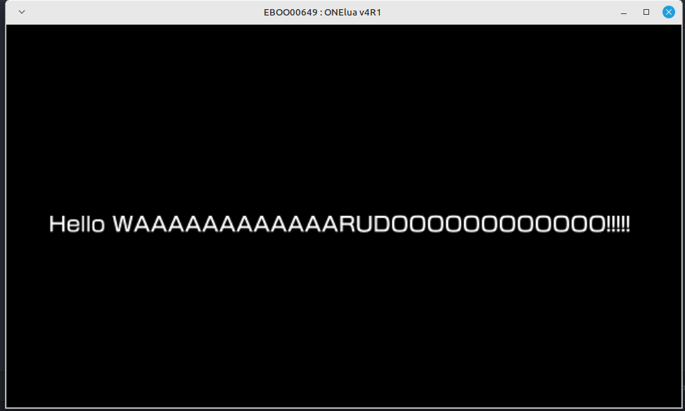

[](https://buymeacoffee.com/legendaryredfox)

# LOVE-WrapLua

A [LÖVE](https://love2d.org/) 11.5 compatibility layer for **PSP**, **PS Vita**, **PS3** and
**Nintendo 3DS**.
Drop your LÖVE game into `game/` and boot the wrapper. It re-implements the LÖVE
API on top of each console's native Lua SDK, so a game written against `love.*`
runs on the handheld or console without a real LÖVE runtime.

> **Scope.** This is a 2D subset of LÖVE aimed at homebrew hardware. GPU-heavy
> features (Canvas/render-to-texture, shaders, meshes) are stubbed: see
> [Known limitations](#known-limitations). If your game is sprite-based 2D, it
> should port with little or no change.

**Contents:** [Supported platforms](#supported-platforms) ·
[Quick start](#quick-start) · [Minimal game](#minimal-game) ·
[Compatibility matrix](#compatibility-matrix) ·
[Building and deploying](#building-and-deploying) ·
[Porting a LÖVE game](#porting-a-löve-game) · [Configuration](#configuration) ·
[Input model](#input-model) · [Running the tests](#running-the-tests) ·
[Known limitations](#known-limitations) · [Project structure](#project-structure)

---

## Supported platforms

| Platform | Backend (`lv1lua.mode`) | Native SDK | Tier |
|---|---|---|---|
| PS Vita | `OneLua` | [OneLua](http://onelua.x10.mx/) | 1, supported |
| PSP | `OneLua` (PSP sub-mode) | OneLua | 1, supported |
| PS Vita (alternative) | `lpp-vita` | [lpp-vita](https://github.com/Rinnegatamante/lpp-vita) | 2, partial |
| PS3 | `PS3` | Lua Player PS3 (tiny3D) | 2, partial |
| Nintendo 3DS | `3DS` | [lpp-3ds](https://github.com/Rinnegatamante/lpp-3ds) | 3, experimental |

The backend is selected automatically at boot (see [Entry points](#entry-points)).
PSP is detected at runtime via `os.cfw`, and reports itself as `__MODE = "PSP"`
to the test harness and the capability table.

### Support tiers

| Tier | Backends | What to expect | How to develop |
|---|---|---|---|
| **1, supported** | OneLua on Vita and PSP | The API coverage below holds; tested on hardware and in emulators | Build and run directly; confirm blend, timing and saves on device |
| **2, partial** | lpp-vita, PS3 | Draw, quads, rotation, transforms and primitives work; a few peripheral calls (`clear` mid-frame, the default filter on PS3) do not reach the hardware. PS3 draws through tiny3D, but nothing there is emulator-verifiable because RPCS3 homebrew loading is minimal ([#18997](https://github.com/RPCS3/rpcs3/issues/18997)) | Same as tier 1, but check [`Implemented.md`](Implemented.md) before relying on a call; confirm PS3 output on real hardware |
| **3, experimental** | 3DS | Written against the lpp-3ds sources and tested through a mock that enforces them, but not yet confirmed on a console or in Citra / Azahar | Write and test game logic on **desktop LÖVE 11.5**, then confirm output on real hardware or an emulator |

Tier 3 is a statement about the backend, not about your game: logic, input,
filesystem, math and data all behave the same there. What is unconfirmed is the
native layer underneath.

---

## Quick start

1. **Add your game.** Copy your LÖVE project into `game/` (`main.lua`,
   optional `conf.lua`, and all assets).
2. **(Optional) configure the wrapper** by defining `lv1luaconf` *before* the
   wrapper boots, at the very top of `game/main.lua`:

   ```lua
   lv1luaconf = {
       keyconf  = "XB",   -- button layout, see Configuration
       imgscale = false,  -- shrink images by the backend's scale factor
       resscale = false,  -- shrink every draw coordinate by that factor
   }
   ```
3. **(Optional) `game/conf.lua`.** A standard LÖVE `conf.lua` works; the wrapper
   reads `t.identity` (used for the save directory) and `t.window.title`.
4. **Build and deploy** for your target, see [Building and deploying](#building-and-deploying).
5. **Check coverage** for anything exotic your game uses in the
   [compatibility matrix](#compatibility-matrix) and in [`Implemented.md`](Implemented.md).

### Minimal game

A complete `game/main.lua`: load a spritesheet, animate it, draw it, read input.
The bundled `desAnim8` ships in `game/libraries/` and works on every backend
(kikito's `anim8` is bundled too and also works).

```lua
local desAnim8 = require 'libraries.desAnim8'

local player

function love.load()
    local sheet = love.graphics.newImage('assets/player.png')  -- 288x48, six 48x48 frames

    -- Grid turns the sheet into quads; Animation plays a list of quads.
    local grid = desAnim8.newGrid(48, 48, sheet:getWidth(), sheet:getHeight())
    player = {
        img  = sheet,
        anim = desAnim8.newAnimation(grid('1-6', 1), 0.15),
        x    = 100,
        y    = 100,
        speed = 120,
    }
end

function love.update(dt)
    player.anim:update(dt)

    local js = love.joystick.getJoysticks()[1]
    if js:isGamepadDown("dpleft")  then player.x = player.x - player.speed * dt end
    if js:isGamepadDown("dpright") then player.x = player.x + player.speed * dt end
end

function love.draw()
    love.graphics.setColor(1, 1, 1)               -- 0 to 1 floats, not 0 to 255
    player.anim:draw(player.img, player.x, player.y)
    love.graphics.print("Hello from LOVE-WrapLua", 10, 10)
end

-- Console buttons arrive as LÖVE key names. If your game only implements
-- gamepadpressed, the wrapper forwards presses there automatically.
function love.keypressed(key)
    if key == "start" then love.event.quit() end
end
```

A shorter single-strip constructor also exists and remembers its own image:
`desAnim8.new(image, frameW, frameH, numFrames, frameDuration)`, then
`anim:update(dt)` and `anim:draw(x, y)`. See [`game/main.lua`](game/main.lua)
for the runnable sample.

---

## Compatibility matrix

Columns: **OL** = OneLua on Vita, **PSP** = OneLua on PSP, **LPP** = lpp-vita,
**PS3** = Lua Player PS3, **3DS** = lpp-3ds. Legend: **full** = LÖVE behaviour, **partial** = works
with documented gaps, **stub** = callable, does nothing, **none** = not defined on
that backend, so calling it errors.

| Module | OL | PSP | LPP | PS3 | 3DS | Notes |
|---|---|---|---|---|---|---|
| love.graphics (images, quads, draw) | full | full | full | full | full | OneLua (Vita and PSP) blits a scaled, mirrored copy per sheet, and a rotated quad turns that whole copy; the others draw rotated, scaled, tinted quads natively |
| love.graphics (primitives) | full | full | full | full | full | rectangle/circle/ellipse/arc/line/points/polygon fill; they follow the transform stack on every backend |
| love.graphics (fonts, print, printf) | full | full | full | full | partial | real text metrics per backend; text follows the transform stack; 3DS text always lands on top of the frame |
| love.graphics (transform stack) | partial | partial | partial | partial | partial | push/pop/translate/scale/rotate/applyTransform; rotation turns what is drawn but not positions, and `shear` is a stub |
| love.graphics (scissor) | tracked | tracked | partial | tracked | full | lpp-vita rejects out-of-scissor draws in software; 3DS clips on the GPU; elsewhere getScissor answers but nothing is clipped |
| love.graphics (SpriteBatch, Text) | full | full | full | full | full | shared implementation (`core/objects.lua`); `draw(batch, x, y, r, sx, sy, ox, oy)` places the whole batch |
| love.graphics (ParticleSystem) | partial | partial | partial | partial | partial | basic emitter (`core/particles.lua`): no size, colour or rotation curves |
| love.graphics (Canvas, Shader, Mesh) | stub | stub | stub | stub | stub | `getSupported().canvas` and `.shader` are `false`; drawing a Canvas does nothing |
| love.graphics (blend mode) | tracked | partial | tracked | full | tracked | PSP: `add`/`subtract` on whole images. PS3: all eight modes. Both Vita backends expose no blend call, so the mode is tracked and alpha renders. Ask `love.graphics.isBlendModeSupported(mode)` |
| love.audio | partial | partial | partial | partial | partial | shared Source (`core/audio.lua`, LÖVE 11 play/pause semantics); 2 simultaneous voices on OneLua/PSP, 1 background voice on PS3 (the last stream played holds it), WAV/OGG/AIFF without volume on 3DS; position and pitch are timed in software, `seek` moves the reported position only |
| love.keyboard | full | full | full | full | full | edge-triggered press/release, optional key repeat, `isDown(k1, k2, ...)` |
| love.joystick | full | full | full | full | full | one virtual gamepad: axes, buttons and the d-pad hat are filled every frame |
| love.touch / love.mouse | full | none | none | none | none | Vita front touchscreen, OneLua only; every touch and mouse callback fires, and the first finger is mouse button 1 |
| love.filesystem | full | full | full | full | full | `mount`/`unmount` are stubs; `modtime` is 0; 3DS goes through `System.openFile` (lpp-3ds replaces `io`) |
| love.math | full | full | full | full | full | own RNG, Perlin 1D to 4D, 2D affine transforms, triangulate |
| love.data | full | full | full | full | full | real hash and deflate/zlib; `pack`/`unpack` need Lua 5.3 |
| love.timer | full | full | full | full | full | Fixed-timestep updates (`lv1luaconf.updaterate`); PS3 has no timer, so its frame time is assumed and `getTime` is the frame clock |
| love.window | partial | partial | partial | partial | partial | always fullscreen, `setMode` is a no-op |
| love.system | full | full | full | full | full | `getOS()` returns `"LOVE-WrapLua"`; battery is native on lpp-vita and 3DS (in steps of 20%), `nobattery` on PS3, `unknown` on OneLua; clipboard is process-local |
| love.thread | partial | partial | partial | partial | partial | coroutine pseudo-threads, synchronous by design; errors reach `getError` and `love.threaderror` |
| love.event | full | full | full | full | full | `quit` flushes open save handles first; `love.quit` returning true cancels it |

Per-function detail lives in [`Implemented.md`](Implemented.md).

### Feature flags and limits

These come from the single capability table in
[`LOVE-WrapLua/core/capabilities.lua`](LOVE-WrapLua/core/capabilities.lua), which
is also what `love.graphics.getSupported()`, `love.graphics.getSystemLimits()`
and `love._backend` return at runtime. Query them instead of hardcoding a backend
check.

| Capability | OL | PSP | LPP | PS3 | 3DS |
|---|---|---|---|---|---|
| `getSupported().canvas` | false | false | false | false | false |
| `getSupported().shader` / `glsl3` | false | false | false | false | false |
| `getSupported().fullnpot` | false | false | **true** | false | **true** |
| `getSystemLimits().texturesize` | 512 | 512 | 1024 | 512 | 1024 |
| `getSystemLimits().pointsize` | 1 | 1 | 1 | 1 | 1 |
| power-of-two textures required | no | **yes** | no | no | no |
| `love._backend.tier` (see [Support tiers](#support-tiers)) | 1 | 1 | 2 | 2 | 3 |

```lua
if love.graphics.getSupported().canvas then
    -- real offscreen target
else
    -- draw straight to the screen
end
```

---

## Building and deploying

The wrapper is Lua plus assets; packaging is done by the target SDK. Exact tool
versions change over time, so follow each SDK's current docs. The notes below
tell you which entry file and layout the wrapper expects.

### PS Vita, lpp-vita

- Entry point: **`index.lua`** (sets `lv1lua.mode = "lpp-vita"`, `dataloc = "app0:/"`).
- Package the project root (with `index.lua`, `script.lua`, `game/`, `LOVE-WrapLua/`)
  into a VPK using the lpp-vita loader and `vita-mksfoex` toolchain from the
  [lpp-vita releases](https://github.com/Rinnegatamante/lpp-vita/releases).
- Install the `.vpk` with VitaShell, launch from LiveArea.

### PS Vita and PSP, OneLua

- Boot path uses **`script.lua`** (OneLua sets `lv1lua.mode = "OneLua"` when no
  mode is preset; `dataloc = ""`).
- Run inside the OneLua interpreter, or build a standalone with OneLua's compiler.
  A prebuilt **`EBOOT.PBP`** (PSP) and **`oneFont.pgf`** are included as a
  starting point.
- PSP: place the EBOOT plus the project under `ms0:/PSP/GAME/LOVE-WrapLua/`.
- See the [OneLua](http://onelua.x10.mx/) docs for packaging specifics.

### PS3, Lua Player PS3

- Entry point: **`app.lua`** (loads `script.lua`).
- **Tier 2, partial.** Sprites, quads, primitives and TTF text draw through the
  player's tiny3D binding (`gfx.*`); there is no hardware scissor.
- RPCS3 cannot be used as a safety net: its homebrew loading is minimal
  ([#18997](https://github.com/RPCS3/rpcs3/issues/18997)). Develop against
  **desktop LÖVE 11.5**, then confirm on real hardware.

### Nintendo 3DS, lpp-3ds

- Entry point: **`index.lua`**, the same file lpp-vita boots. It tells the two
  players apart by the `TOP_SCREEN` constant only lpp-3ds defines, then sets
  `lv1lua.mode = "3DS"`.
- `.3dsx`: put the project next to the lpp-3ds `.3dsx` on the SD card; `dataloc`
  is that folder (`System.currentDirectory()`). CIA: pack the project into the
  romfs; `dataloc` becomes `romfs:/`.
- Saves go to `/3ds/data/<identity>/` on the SD card (romfs is read-only).
- Everything draws to the 400x240 top screen. Text is printed after the frame's
  sprites and shapes (lpp-3ds prints into the CPU framebuffer once the GPU frame
  is done), so it is always on top, and a line that starts off screen is skipped.
- Audio is WAV, OGG or AIFF only; there is no MP3 decoder, volume, pitch or seek.

### Entry points

| File | Target | Purpose |
|---|---|---|
| `script.lua` | all | Bootstrap: sets up `love`, loads modules, runs the loop |
| `index.lua`  | lpp-vita, 3DS | Detects the player, sets mode and `dataloc`, then loads `script.lua` |
| `app.lua`    | PS3 | Loads `script.lua` |

---

## Porting a LÖVE game

A practical checklist, roughly in the order things bite:

1. **Colors are 0 to 1 floats.** LÖVE 11.x range. Any `setColor(255, 255, 255)`
   renders white-clipped or wrong. Convert, or call
   `love.math.colorFromBytes(r, g, b)`.
2. **Drop desktop-only input.** Keyboard and mouse do not exist on these consoles
   (except the Vita front touchscreen on OneLua). Route everything through
   `love.keypressed` / `love.gamepadpressed` and the single virtual joystick, see
   [Input model](#input-model).
3. **Resize to the console.** PSP is 480x272, PS3 is 720x480, Vita is 960x544,
   the 3DS top screen is 400x240. Use `love.graphics.getDimensions()` rather than
   hardcoded numbers, or set `resscale = true` for a quick downscaled pass.
4. **Fix spritesheets for the target.** PSP needs power-of-two sheets no larger
   than 512x512, so split oversized atlases. Oversize or non-power-of-two sheets
   log a `[LOVE-WrapLua]` warning at `newImage`/`newQuad` instead of corrupting
   silently.
5. **Remove Canvas, Shader and Mesh dependencies.** They are stubs: calls succeed,
   nothing renders offscreen. Gate them on `love.graphics.getSupported()`.
6. **Check blend modes before relying on one.** `love.graphics.isBlendModeSupported`
   answers per backend: PSP applies `add` and `subtract` to whole-image draws,
   PS3 applies all eight, and both Vita backends have no blend call at all, so
   the mode is remembered and alpha is what renders.
7. **Make threads optional.** `love.thread` runs synchronously on a coroutine, so
   a thread body with an infinite loop hangs the app, and `Channel:demand` never
   blocks.
8. **Watch file sizes and load times.** Consoles have slow storage and small RAM.
   `love.data.compress` works but the pure-Lua deflate is slow on device, so cache
   results rather than compressing every frame.
9. **Test on desktop LÖVE first**, then an emulator, then real hardware, see
   [Testing and validation targets](#testing-and-validation-targets).

---

## Configuration

### `lv1luaconf` (wrapper options)

Define it before the wrapper boots, at the top of `game/main.lua`.

| Key | Values | Default | Effect |
|---|---|---|---|
| `keyconf` | `"XB"`, `"XBA"`, `"PS"`, `"SE"` | `"XB"` | Physical to logical face-button mapping |
| `imgscale` | boolean | `false` | Shrinks images by the backend's factor (0.75 Vita, 0.375 PSP, 0.5625 PS3, none on 3DS) |
| `resscale` | boolean | `false` | Shrinks every draw coordinate by that factor |
| `updaterate` | number, or `"variable"` | `60` | Fixed updates per second. `love.update` gets exactly `1/updaterate` as `dt`, whatever the frame took. `"variable"` restores desktop LÖVE's one-update-per-frame with the measured `dt` |
| `maxframeskip` | number | `5` | Most update slices one frame may run, so a long stall (loading, sleep and resume) cannot queue hundreds of catch-up updates |

**Timing.** Game logic runs on a fixed-timestep accumulator: the real frame time
is measured, `love.update` is called in fixed slices, and the remainder is
carried into the next frame. `love.timer.getDelta` reports the update slice,
while `getFPS` and `getAverageDelta` report the measured render rate, which is a
different number.

`keyconf` values: `"XB"` is the Xbox layout, `"XBA"` swaps confirm and cancel,
`"PS"` uses PlayStation names (`circle`, `cross`, `triangle`, `square`, `l`, `r`),
and `"SE"` auto-detects the console's own enter button (circle on Japanese units,
cross elsewhere) and resolves to `"XB"` or `"XBA"`. Any other value warns and
falls back to `"XB"`. The older spellings `img_scale` and `res_scale` are still
accepted.

### `game/conf.lua` (standard LÖVE config)

A normal LÖVE `conf.lua` is loaded and `love.conf(t)` is called when it is
defined. The wrapper uses `t.identity` (save directory name on the Vita and 3DS,
defaults to `"LOVE-WrapLua"`) and `t.window.title`. Window size and flags are ignored: consoles are always
fullscreen at their native resolution.

---

## Input model

- Console buttons arrive through `love.keypressed(key, scancode, isrepeat)` and
  `love.keyreleased(key, scancode)` using names like `"a"`, `"b"`, `"start"`,
  `"dpleft"`, `"leftshoulder"`. Both fire once per physical press or release.
- Key repeat is off by default; `love.keyboard.setKeyRepeat(true)` enables it
  (first repeat after 0.4s, then every 0.05s).
- If your game only defines `love.gamepadpressed` / `love.gamepadreleased`, the
  wrapper forwards presses to them using the first joystick, with the d-pad
  under its gamepad names (`dpup`, `dpdown`, `dpleft`, `dpright`).
- `love.joystick.getJoysticks()[1]` always returns a connected virtual gamepad;
  use `:isGamepadDown(...)`, `:getGamepadAxis(...)`, `:getAxis(n)`, `:getHat(n)`.
- `keyconf` picks the physical to logical layout, see [Configuration](#configuration).

---

## Running the tests

Tests run on desktop Lua (5.1 / 5.3 / 5.4 / LuaJIT), no console needed. The
harness mocks each console SDK, grounded in the SDK sources (native argument
orders, integer-only arguments, which calls exist), and runs the shared suites
under every backend (`OneLua`, `PSP`, `lpp-vita`, `PS3`, `3DS`).

```bash
lua tests/run_all.lua           # full suite, exits non-zero on failure
lua tests/math_test.lua         # a single suite
```

Target a specific backend in a single suite by setting `__MODE` before loading
the setup file:

```lua
__MODE = "PSP"
dofile("tests/setup.lua")
```

Run the full suite on every interpreter you support before committing.

---

## Known limitations

Honest current state. These are platform or design limits, not regressions.
Per-function detail is in [`Implemented.md`](Implemented.md).

- **Canvas** is a stub on every backend (`getSupported().canvas == false`).
  `renderTo(fn)` runs `fn()` but draws to the screen, not to an offscreen target,
  and drawing the Canvas afterwards does nothing.
  Native paths exist and are not wired yet: lpp-vita/vita2d has rendertarget
  textures with no Lua bind (a small upstream patch), and PS3 tiny3D has
  scene-to-texture surfaces. OneLua exposes none.
- **Shader and Mesh** are stubs. The objects exist so call sites do not crash,
  nothing renders.
- **Blend mode** depends on the backend, because only two of the four expose a
  blend call to Lua. PSP maps `add` and `subtract` onto OSLib's `image.blitadd`
  / `image.blitsub`, which take whole images (a quad draw or a primitive stays
  alpha). PS3 maps all eight LOVE modes onto tiny3d's `gfx.BlendFunction`.
  ONElua on Vita dropped the PSP's additive blits, and lpp-vita has no blend
  entry point at all (`Graphics.initBlend` / `termBlend` are the drawing-phase
  begin/end), so on both the mode is tracked and alpha is what renders. Ask
  `love.graphics.isBlendModeSupported(mode)`, and verify any blend-dependent
  look on real hardware, not on an emulator.
- **love.thread** pseudo-threads run **synchronously** on a coroutine (no real
  parallelism). A thread body that loops forever hangs the app. `Channel:supply`
  is an immediate push and `Channel:demand` is a non-blocking pop.
- **Transforms** are one shared software stack on every backend
  (translate/scale/rotate/push/pop), folded into images, shapes and text alike.
  The stack keeps an offset, a scale and an angle per level, so `rotate` turns
  what is drawn but does not rotate the positions that follow it, and `shear` is
  a stub. Scissor is enforced in software on lpp-vita and on the GPU on the 3DS,
  and only tracked elsewhere.
- **love.audio**: OneLua supports about 2 simultaneous channels; PS3 supports
  stream sources only, one at a time.
- **love.data.hash / compress / decompress** are real (vendored `sha2.lua` and
  LibDeflate, byte-compatible with desktop LÖVE for `deflate` and `zlib`), but
  pure Lua and slow on device, so cache results. `gzip` and `lz4` fall back to
  deflate and are **not** byte-compatible with those two desktop formats.
- **Quad edge-bleed**: `love.graphics.setTextureInset(px)` (a wrapper extension,
  default `0`) shrinks every quad's source rect by `px` texels per side so linear
  filtering stops sampling the neighbouring frame. Use `0.5` for tightly packed
  linear-filtered sheets; pixel art is better served by nearest filtering. On
  lpp-vita and the 3DS the native source origin is an integer, so the inset rounds inward to
  whole texels (`0.5` trims one texel per side).
- **Save durability**: `write` and `append` open, write and close in one call. A
  long-lived `newFile` handle is tracked and closed automatically at
  `love.event.quit`, but calling `File:close()` yourself flushes earliest.

---

## Testing and validation targets

Work in this order: **desktop LÖVE 11.5** for game logic (fastest iteration),
then an **emulator** for a rough look at the real backend, then **real hardware**,
which is the only source of truth for blend, timing and save behaviour.

### Dev target matrix

Per target, what you can trust. **works** = matches hardware in practice,
**emulator-dependent** = varies by graphics backend, recheck on device,
**unsupported** = not available at all, **unverified** = nobody has confirmed it.

| Area | Real hardware | Vita3K (OpenGL) | Vita3K (Vulkan) | PPSSPP (PSP) | RPCS3 (PS3) | Citra / Azahar (3DS) |
|---|---|---|---|---|---|---|
| Boot / run the wrapper | works | works | works | works | unverified | unverified |
| Sprite draw, quads, animation | works | works | works | works | unverified | unverified |
| 2D primitives, text | works | works | works | works | unverified | unverified |
| Alpha blending | works | emulator-dependent | emulator-dependent | emulator-dependent | unverified | unverified |
| Framebuffer readback, screenshots | works | emulator-dependent | emulator-dependent | emulator-dependent | unverified | unverified |
| Quad edge filtering | works | works | works | emulator-dependent | unverified | unverified |
| Save flush on close | works | emulator-dependent | emulator-dependent | works | unverified | unverified |
| Input, gamepad mapping | works | works | works | works | unverified | unverified |
| Audio | works | emulator-dependent | emulator-dependent | works | unverified | unverified |

The 3DS column is unverified across the board: the backend is checked against
the lpp-3ds sources, not yet run. Emulator targets and versions: **Vita3K** for
the Vita backends (OneLua and lpp-vita), **PPSSPP** for PSP, **RPCS3** for PS3,
**Citra / Azahar** for the 3DS. RetroArch PSP/Vita cores work
for a smoke test but give you less diagnostic output than the standalone builds.

### Renderer caveats

- **Vita3K** programmable blend and framebuffer reads are inaccurate
  ([#4109](https://github.com/Vita3K/Vita3K/issues/4109),
  [#422](https://github.com/Vita3K/Vita3K/issues/422)) and differ between OpenGL,
  Vulkan and MoltenVK. Never sign off a blend-dependent or readback-dependent
  look there.
- **Vita3K** can lose writes when the emulator is closed
  ([#3918](https://github.com/Vita3K/Vita3K/issues/3918),
  [#3659](https://github.com/Vita3K/Vita3K/issues/3659)). The wrapper closes
  every open handle at `love.event.quit`, but confirm save-critical flows on a
  real Vita.
- **PPSSPP** bleeds a row of texels from the other side of a quad under linear
  filtering ([#14977](https://github.com/hrydgard/ppsspp/issues/14977)), and its
  framebuffer/texture sizing can differ from hardware
  ([#3085](https://github.com/hrydgard/ppsspp/issues/3085)). Use
  `love.graphics.setTextureInset(0.5)` or nearest filtering.
- **RPCS3** homebrew loading is minimal
  ([#18997](https://github.com/RPCS3/rpcs3/issues/18997)), so the PS3 backend is
  effectively untestable there. Develop PS3 game logic on desktop LÖVE and confirm
  on hardware.

The same information is machine-readable, so a game can degrade itself instead of
hardcoding an emulator check:

```lua
local caps = love._backend
if caps.rendersensitive.blendmode then
    -- do not let the look depend on blending; caps.emulator names the emulator
end
```

`rendersensitive` fields: `blendmode`, `framebufferread`, `texturefilter`,
`savepersistence`.

---

## Constraints to keep in mind

- **PSP textures** must be power-of-two and at most 512x512. Split larger
  spritesheets. lpp-vita allows up to 1024x1024 and non-power-of-two.
- **Screen sizes:** PSP 480x272, PS3 720x480, Vita 960x544, 3DS 400x240. Use
  `love.graphics.getDimensions()` rather than hardcoding.
- **Spritesheet edge bleed:** leave a 1px gutter between frames (Grid `border`)
  or use nearest filtering to avoid neighbouring frames bleeding in.

---

## Project structure

Each `love.*` module is an entry point that loads one file per area of the API,
so `OneLua/graphics.lua` is a short list of `lv1lua.load` calls and the code sits
in `OneLua/graphics/`.

```
game/           <- your LÖVE game lives here (main.lua, conf.lua, assets)
script.lua      <- wrapper bootstrap: ordered core/* steps, then the main loop
index.lua       <- lpp-vita and 3DS entry point
app.lua         <- PS3 entry point
LOVE-WrapLua/
  core/         <- backend-agnostic: loader, util, transform stack and its
                   love.graphics surface, word wrap, capabilities, polygon
                   fill, texture inset, primitives, graphics state, Image,
                   Font and printf, objects (Canvas/Shader/SpriteBatch/Text),
                   ParticleSystem, Mesh, audio Source, input, timestep,
                   runtime, config, module list, require shim, callbacks
  math.lua      <- entry point over math/{random,noise,transform,geometry,color}
  filesystem.lua / data.lua / window.lua / joystick.lua / system.lua
  love-functions/thread.lua
  vendor/       <- sha2.lua, LibDeflate (love.data)
  OneLua/       <- Vita modules (graphics/), PSP modules (psp/), and the image
                   draw both share (imagedraw.lua)
  lpp-vita/     <- lpp-vita platform modules (graphics/)
  PS3/          <- PS3 Lua Player platform modules (graphics/)
  3DS/          <- lpp-3ds platform modules (graphics/, fileio.lua)
tests/          <- unit tests (desktop Lua), one suite per area, every backend
Implemented.md  <- detailed per-backend API coverage table
Changelog.md    <- what changed, newest first
CODE_REVIEW.md  <- the latest whole-repository review and QA pass
AGENTS.md       <- orientation guide for contributors and AI agents
```

---

## Notes

- Tested primarily on PSP and Vita; the 3DS is the least confirmed backend, see
  [Support tiers](#support-tiers).
- Sample assets are from [Kenney](https://kenney.nl/assets/scribble-dungeons) and
  [game-endeavor](https://game-endeavor.itch.io/mystic-woods), go support them.
- Hobby project; updated when time allows.

---

## Ecosystem and prior art

LOVE-WrapLua sits on top of the native homebrew stacks and borrows lessons from
the wider console-OSS scene. Useful to know when you hit a wall or want to
contribute a native feature:

| Layer | Project | What it gives us or teaches |
|---|---|---|
| PSP 2D + fonts | [OSLib / OSLib MOD](https://github.com/PSP-Archive/oslibmodv2) | Mature C 2D lib with an animated **Sprites Lib** and **intraFont** text (UTF-8, fixed-width blit). Confirms native text width and blend/alpha are available on PSP. |
| Vita 2D | [vita2d](https://github.com/xerpi/libvita2d) | The C lib lpp-vita wraps. Has tint/rotate/scale/part draw calls (quad plus rotation in one shot), texture filters, freetype fonts, and `create_empty_texture_rendertarget`, the hook a future **Canvas** would use. |
| PS3 2D/3D | [tiny3D](https://github.com/cloned67/tiny3d) + [Mini2D](https://github.com/Dnawrkshp/mini2d) | What the PS3 backend draws through. Scene-to-texture **surfaces** make a PS3 Canvas feasible, and there is a pixel-shader pipeline. |
| Whole-framework | [raylib4PlayStation](https://github.com/raylib4PlayStation/raylib4PlayStation) / [raylib-ps3](https://github.com/nbe1233/raylib-ps3) | raylib runs on Vita/PS4/PS3. A clean, zlib-licensed reference for module boundaries and a possible alternative native layer (no PSP target, though). |

If you want to help push past the current limits (Canvas, blend modes on the
Vita, shaders), the projects above are where the native calls to build on live;
[`docs/adr/`](docs/adr/) records the decisions already taken.

---

## Credits and thanks

- [OneLua](http://onelua.x10.mx/) team, for their contributions to the PSP/Vita
  homebrew community.
- [Rinnegatamante](https://github.com/Rinnegatamante/lpp-vita), lpp-vita.
- [LukeZGD](https://github.com/LukeZGD/LOVE-WrapLua), original author of
  LOVE-WrapLua; this is a continuation of that archived project.
- [DDLC-LOVE](https://github.com/LukeZGD/DDLC-LOVE/), the project that originally
  used this wrapper.
